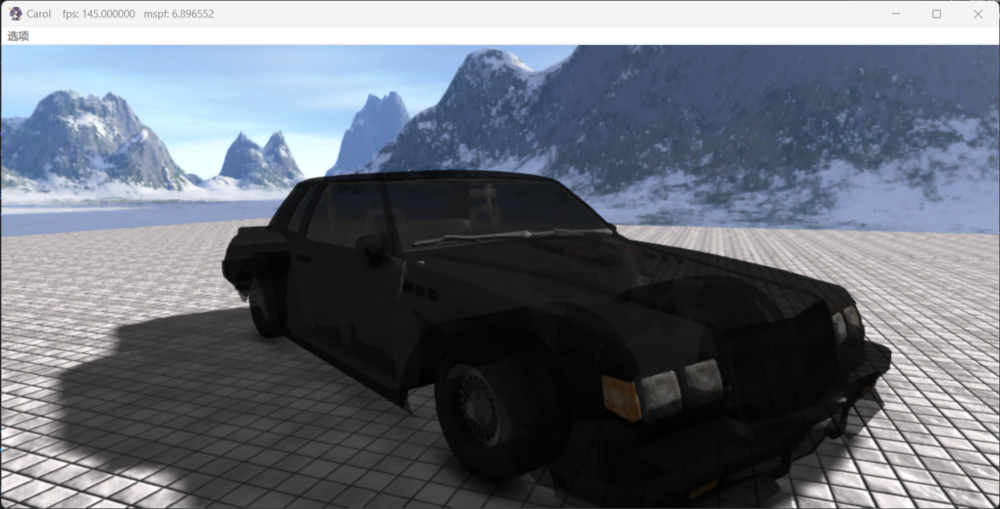
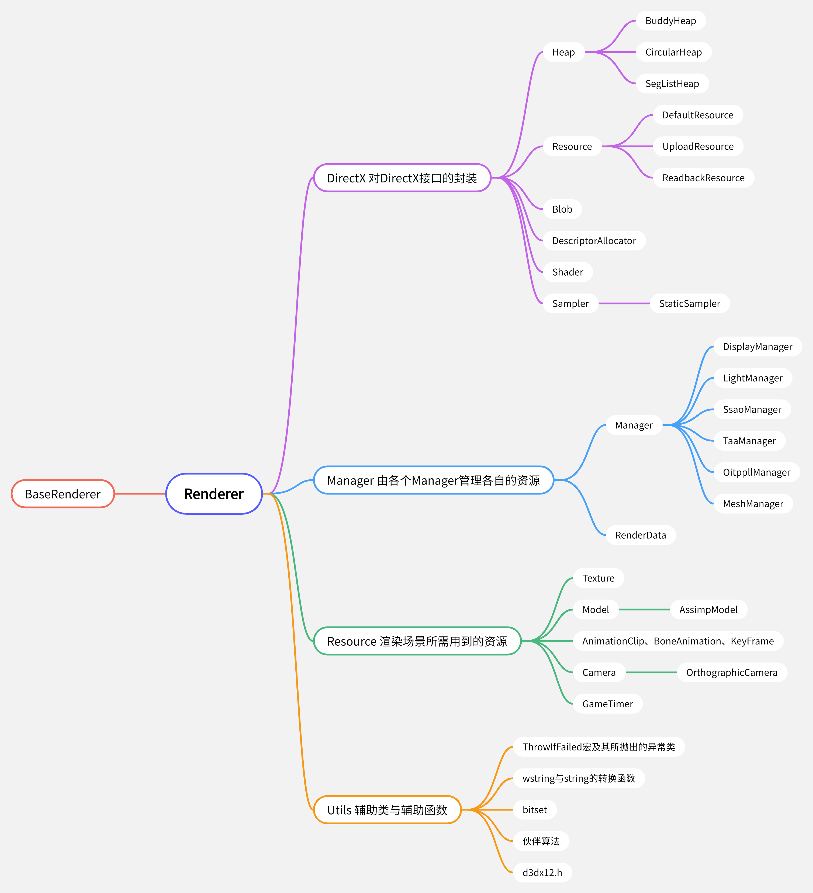
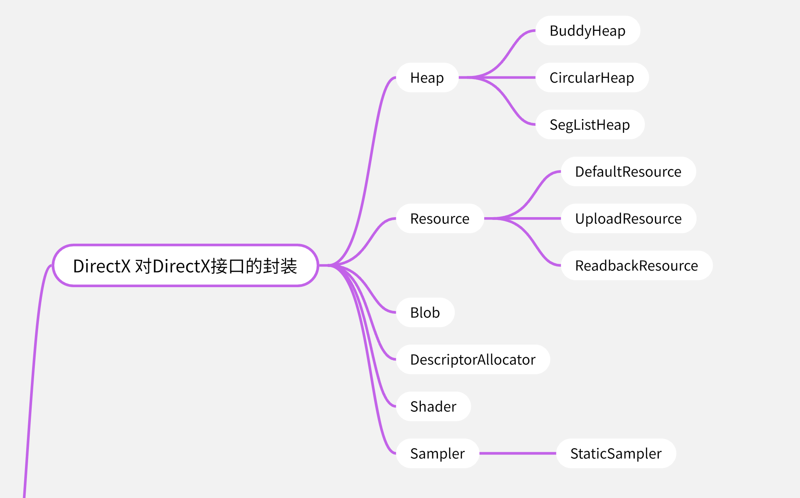
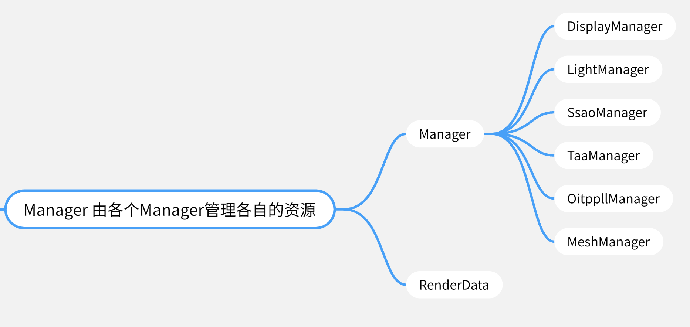
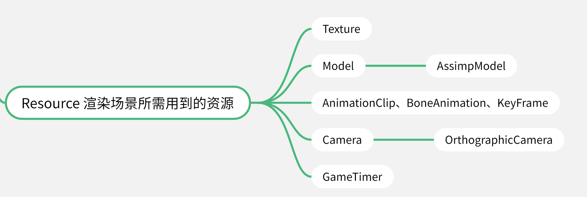
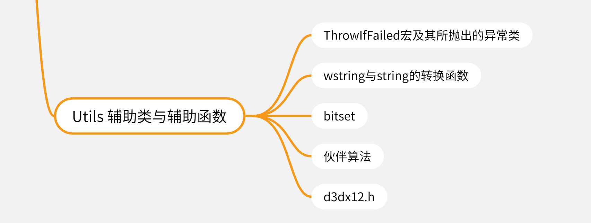

# 基于DirectX 12的实时渲染器

## 项目结构

### 对DirectX接口的封装

DirectX12使用COM接口编写，并且相较于传统的图形API要更为底层，本项目对DirectX12提供的接口进行封装并实现所需要的功能。

1. Heap
   DirectX12给开发者提供了绕过驱动程序直接分配堆并管理显存的接口，本项目的Heap类即实现了显存管理的功能。
   - BuddyHeap使用伙伴堆算法管理显存以减少显存碎片，主要用于分配缓冲资源。
   - CircularHeap使用循环队列来简化显存的分配过程，主要用于分配生命周期为一帧的常量缓冲。
   - SegListHeap根据资源的大小将资源分配到不同的堆上，例如：64KB大小的资源统一分配，4MB大小的资源统一分配，二者互不干扰，主要用于分配资源大小相对而言有规律的纹理资源。

2. Resource
   DirectX12中不再将资源分为纹理、缓冲等类别，而是只提供一个统一的ID3D12Resource资源类，本项目根据资源所分配的堆的类型的不同进行封装并提供相应的方法。
   - DefaultResource是分配在默认堆上的资源，需要CPU将资源写入共享内存中的上传堆，再由GPU读入显存使用。DefaultResource封装了中间上传缓冲资源，并提供上传默认资源与释放中间资源的方法。
   - UploadResource是分配在上传堆上的资源，上传堆分配在共享内存中，CPU和GPU都可以对其进行修改。
   - ReadbackResource是分配在回读堆上的资源，需要GPU将资源写入共享内存中的上传堆，并由CPU读入内存。

3. Blob
   ID3DBlob为DirectX12中所使用的二进制数据缓冲，例如着色器经过编译后就需要通过ID3DBlob来上传至GPU中，本项目对其进行简单封装。

4. DescriptorAllocator
   对于GPU来说上传至其中的资源需要通过描述符来进一步解释，除了跟随根签名一同上传的描述符之外，所有描述符都需要分配在描述符堆上。描述符堆需要分为普通描述符堆与着色器可见描述符堆。普通描述符堆CPU可读可写，着色器可见描述符堆CPU只能进行写入并由GPU访问。我们维护CPU端与GPU端两个堆，CPU端分配所有资源的描述符，绘制时再根据每帧的情况将所需要的描述符从CPU端复制到GPU端。
   本项目中每个Manager会去负责向描述符分配器申请空间用于分配，描述符分配器采用伙伴算法进行分配。

5. Shader
   将存储着色器的Blob进行封装并提供编译着色器的方法。

6. Sampler
   对纹理采样器进行封装。

### Manager

由各个Manager类管理各自的纹理、缓冲等资源，并且负责资源的绘制与更新。RenderData类中存储各个Manager共用的资源的指针，例如命令对象、资源堆、描述符分配器等，相当于全局变量。

1. DisplayManager
   屏幕画面的绘制需要通过交换链来实现，即一个缓冲用于显示，另一个缓冲负责绘制，绘制完毕后二者的功能进行交换。DisplayManager对交换链进行封装，并管理负责显示与绘制画面的后缓冲以及深度缓冲。

2. LightManager
   本项目中的LightManager主要负责管理光照信息以及阴影的绘制。本项目中目前只维护一个平行光主光源，通过正交投影进行阴影映射，通过深度比较绘制阴影。

3. SsaoManager
   主要负责实现屏幕空间环境光遮蔽（SSAO，Screen-Space Ambient Occlusion）。通过在屏幕空间获取各个像素周围的深度与法向量情况来获取环境光遮蔽结果，用于增强阴影。

4. TaaManager
   主要负责实现时序抗锯齿（TAA，Temporal Anti-Aliasing）。TAA通过对镜头进行抖动来将超采样的成本分摊到各帧上而非集中在同一帧，通过速度缓冲来解决运动物体的采样问题，通过对多帧进行混合来实现抗锯齿。

5. OitppllManager
   主要负责实现逐像素链表顺序无关透明（OITPPLL，Order-Independent Transparency via Per-Pixel Linked List）。DirectX11.3引入了无序访问描述符（UAV，Unordered Access View），该描述符所绑定的资源在着色器端可读可写，并且提供原子操作来进行正确的写入。Oitppll利用原子操作来构建链表，通过构建的链表混合出多个透明物体相重叠的情况下该像素最终的颜色。

6. MeshManager
   本项目以子多面体为单位进行物体的绘制，每个模型由多个子多面体组成，每个子多面体对应一种材质，并且每种类别的纹理也只对应一张。本项目中每个MeshManager会负责管理自己所对应的漫反射纹理与法线纹理，并负责各自的绘制。每个多面体也会维护一个包围盒，若该包围盒不被摄像机的视锥体所包含则不参与绘制。

### 渲染场景所需的资源

1. Texture类负责存储、加载纹理资源，它是对DefaultResource的封装，并使用DirectXTex库来进行纹理的加载。

2. Model类存储模型顶点与顶点索引缓冲、骨骼信息、世界矩阵等信息，对于动态物体也会负责每一帧动画的更新，这些信息由模型的各个子多面体在绘制时上传至GPU使用。由于本项目使用Assimp库来加载模型，故派生出AssimpModel类。
   
3. AnimationClip类负责封装BoneAnimation并提供动画关键帧插值的方法，BoneAnimation存储动画中的关键帧、实现具体的插值方法，KeyFrame中存储关键帧信息。

4. Camera实现基本的摄像机功能，使用透视投影并维护一个视锥体用于与多面体的包围盒求交来决定是否绘制该多面体。OrthographicCamera是使用正交投影的Camera子类，本项目中的平行光源产生的阴影需要使用正交投影。
  
5. GameTimer实现基本的时钟功能，并负责计算帧数。
  
### 帮助类与帮助函数

1. ThrowIfFailed宏
   许多COM接口的方法的返回值为HRESULT类型，若其值不为S_OK则会包含错误信息。ThrowIfFailed宏会获取错误产生的函数、文件、所在行以及HRESULT返回值中所包含的信息，这些信息存储在异常类中并抛出，catch后弹出窗口提示用户错误信息。

2. wstring与string的转换函数
   本项目使用wstring来实现字符串，但string的使用仍然不可避免，例如加载模型的Assimp库中使用的是Assimp库自定义的字符串aiString，使用char类型的字符，需要转换为string再转换为wstring。

3. bitset与伙伴算法
   主要用于伙伴堆的实现，通过bitset来标记存储空间的某个部分是否被使用。

4. d3dx12.h
   包含各类微软官方实现的帮助函数与帮助类，DirectXTex库的调用也需要使用该头文件。

