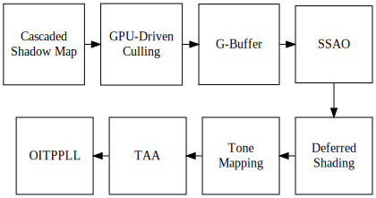

# CarolRenderer

## Dependencies:

- *Assimp* 5.2.5
- *DirectXTex* 2023.4.28.1
- *D3D12 Agility* 1.610.3
- *DirectX Shader Compiler* 1.7.2303.01

## Rendering Pipeline

## Samples

## Features:

- **Model viewer**
  - Model loader based on *Assimp*
    - Currently alpha blending will be closed as methods for identifying automatically whether a mesh needs to be alpha blended have not been found.
    - It's not guaranteed that *Assimp* will correctly load the skinned animations.
  - Texture loader based on *DirectXTex*
    - Texture usage follows glTF 2.0 standard. 
    - You need to offer the path of the folder which stores the textures. 
    - It's not guaranteed that *Assimp* will correctly load the texture path. 
  

- **Physically Based Shading**
  - These are default and the only supported PBR settings now. GUI for PBR settings is under development.
    - Subsurface Scattering BRDF: Lambertian BRDF
    - Specular BRDF:
      - Normal Distribution Function: GGX Normal Distribution Function
      - Geometry Function: Height-Correlated Masking-Shadowing Function

- **Deferred Shading**
  - Store diffuse color, emission, roughness, metalness and normal in G-Buffer

- **Amplification shader and mesh shader**
  - These are features supported by GPU with Turing or more advanced architectures.

- **Shader model 6.6**
  - HLSL Dynamic resources feature is used to simplify the root signature.

- **Viedo memory management**
  - Implemented via buddy system and segregated free lists
  
- **GPU-driven culling**
   - Instance culling is implemented via compute shader
   - Meshlet culling is implemented via amplification shader
   - Supported culling:
     - Frustum culling (instance and meshlet)
     - Normal cone backface culling (meshlet)
     - Hi-Z occlusion culling (instance and meshlet)

- **Cascaded Shadow Map**
  - With split level specified to 5 in default

- **Screen-Space Ambient-Occlusion**
  - Implemented via compute shader with 3 times edge-preserving filtering in default

- **Tone Mapping**
  - Clamp
  - Reinhard
  - ACES

- **Temporal Anti-Aliasing**
  - Impleted vai compute shader
  - Jitter the sample position via Halton low-discrepancy sequence (from Unreal Engine 4)
  - Blend current and history pixel colors in YCoCg space (from Unreal Engine 4)
  - Clip the history pixel color via the bounding-box constructed by the expectation and variance of colors of the sampled neighboring pixel (from NVIDIA)
- **OIT**
  - Implemented via per-pixel linked-list and compute shader
